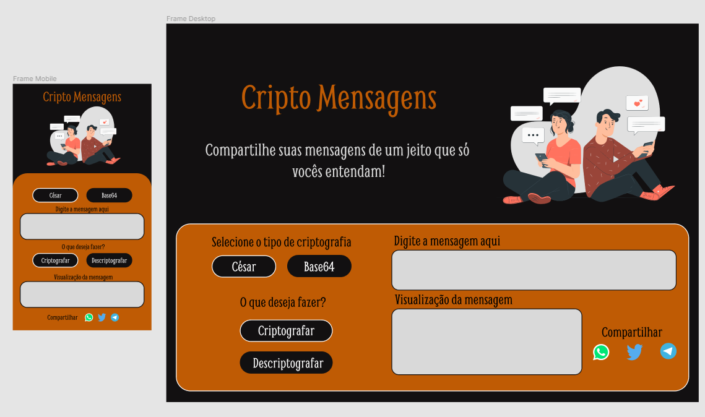

# Cripto Mensagens (em construção)

Esse projeto consiste em um website onde os usuários podem criptografar suas mensagens antes de envia-las para alguém. São dois tipos de criptografia, o cifra de César e o Base64, podendo o usuário escolher entre elas. No caso do cifra de César ser escolhido é possivel escolher um valor de incremento para a mensagem, assim somente você e a pessoa que recebeu poderá descriptografar a mensagem.

# Objetivos

[] - Concluir atividade do curso da Resilia;

[] - Implementar um sistema de criptografia;

[ok] - Praticar o uso do Figma para desenvolvimento do design do projeto;

[] - Praticar o uso do Javascript;

[] - Praticar o uso de HTML e CSS;

# Créditos

Ao professor **Jarom Aidukaitis** por facilitar a realização do projeto;

Ao **@thiagojapyassu**(instagram) por compartilhar idéias de combinação de cores;

Aos idealizadores do website **storyset** por disponibilizar imagens super legais;

### Link do site

[https://arceniosouza.github.io/Cripto-Mensagens/](https://arceniosouza.github.io/Cripto-Mensagens/)